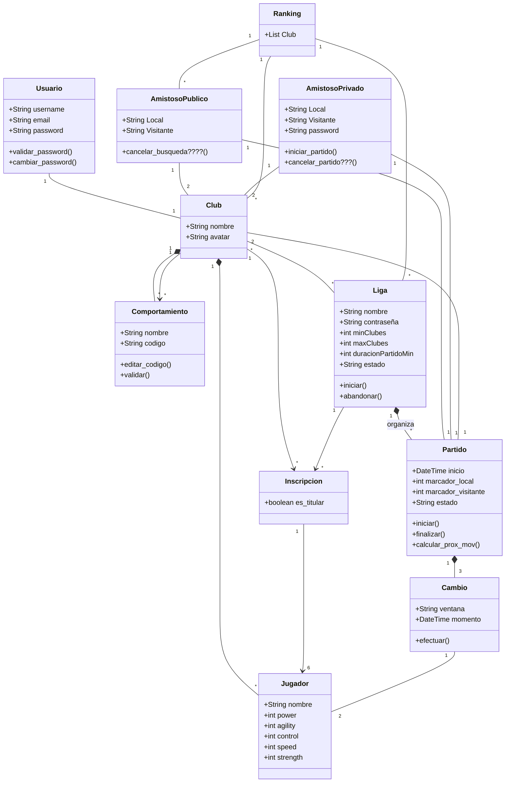

```mermaid
classDiagram
    class Usuario {
        +String username
        +String email
        +String password
        +validar_password()
        +cambiar_password()
    }
    class Club {
        +String nombre
        +String avatar
    }
 
    class Jugador {
        +String nombre
        +int power
        +int agility
        +int control
        +int speed
        +int strength
    }
 
    class Comportamiento {
        +String nombre
        +String codigo
        +editar_codigo()
        +validar()
    }
 
    class Liga {
        +String nombre
        +String contraseña
        +int minClubes
        +int maxClubes
        +int duracionPartidoMin
        +String estado
        +iniciar()
        +abandonar()
    }

    class Ranking {
        +List Club
    }

    class AmistosoPublico{
        +String Local
        +String Visitante
        +cancelar_busqueda????()
    }

    class AmistosoPrivado{
        +String Local
        +String Visitante
        +String password
        +iniciar_partido()
        +cancelar_partido???()
    }
 
    class Inscripcion {
        +boolean es_titular
    }
 
    class Partido {
        +DateTime inicio
        +int marcador_local
        +int marcador_visitante
        +String estado
        +iniciar()
        +finalizar()
        +calcular_prox_mov()
    }
    %% 
    class Cambio {
        +String ventana
        +DateTime momento
        +efectuar()
    }
 
    %% Usuario tiene jugadore. Los jugadores dependen del usuario, composición
    Club "1" *-- "*" Jugador
 
    %% Comporatmiento también depende del usuario
    Club "1" *-- "*" Comportamiento
 
    %% Revisar
    Club "1" --> "*" Comportamiento
 
    %% Club participa en Ligas, y Liga tiene clubes inscriptos asociacion muchos a muchos
    Club "*" -- "*" Liga
 
    %% Inscripcion es la clase de asociacion que resuelve "6 jugadores convocados por club y por liga"
    Club "1" --> "*" Inscripcion
    Liga "1" --> "*" Inscripcion
    Inscripcion "1" --> "6" Jugador
 
    %% Partido depende de ligas
    Liga "1" *-- "*" Partido : organiza
 
    %% Un partido enfrenta a dos clubes (asociacion, el club existe independiente del partido)
    Partido "1" -- "2" Club
 
    %% Un cambio no existe fuera del partido en que ocurre -> composicion
    Partido "1" *-- "3" Cambio
 
    %% Un cambio involucra a un jugador que sale y otro que entra
    Cambio "1" -- "2" Jugador

    %%Cada usuario tiene 1 club propio
    Usuario "1" -- "1" Club

    %% Un amistoso enfrenta a 2 clubes, puede ser privado o publico
    AmistosoPublico "1" -- "1" Partido
    AmistosoPrivado "1" -- "1" Partido
    AmistosoPublico "1" -- "2" Club
    AmistosoPrivado "1" -- "2" Club

    %%El ranking global toma en cuenta los pts obtenidos en Amistosos Publicos y las Ligas
    Ranking "1" -- "*" AmistosoPublico
    Ranking "1" -- "*" Liga
    Ranking "1" -- "*" Club
```