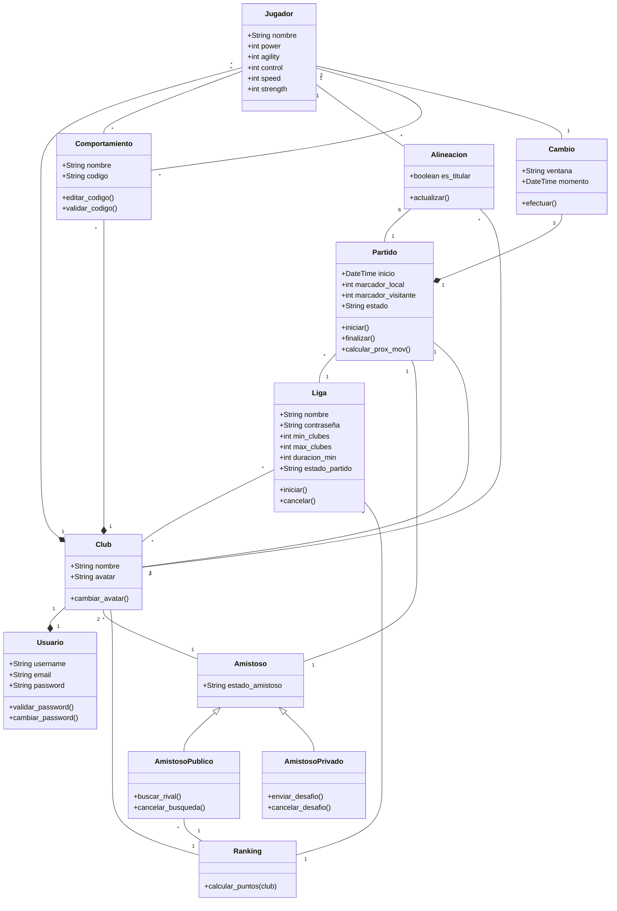

```mermaid
classDiagram
    direction BT

    class Usuario {
        +String username
        +String email
        +String password
        +validar_password()
        +cambiar_password()
    }

    class Club {
        +String nombre
        +String avatar
        +cambiar_avatar()
    }
    
    class Jugador {
        +String nombre
        +int power
        +int agility
        +int control
        +int speed
        +int strength
    }

    class Comportamiento {
        +String nombre
        +String codigo
        +editar_codigo()
        +validar_codigo()
    }
 
    class Liga {
        +String nombre
        +String contraseña
        +int min_clubes
        +int max_clubes
        +int duracion_min
        +String estado_partido
        +iniciar()
        +cancelar()
    }

    class Alineacion {
        +boolean es_titular
        +actualizar()
    }

    class Amistoso {
        +String estado_amistoso
    }

    class AmistosoPublico{
        +buscar_rival()
        +cancelar_busqueda()
    }

    class AmistosoPrivado{
        +enviar_desafio()
        +cancelar_desafio()
    }
 
    class Partido {
        +DateTime inicio
        +int marcador_local
        +int marcador_visitante
        +String estado
        +iniciar()
        +finalizar()
        +calcular_prox_mov()
    }

    class Cambio {
        +String ventana
        +DateTime momento
        +efectuar()
    }

    class Ranking {
        +calcular_puntos(club)
    }

    %% Cada usuario administra un club propio, composición
    Usuario "1" *-- "1" Club
 
    %% Un club tiene muchos jugadores. Los jugadores dependen del club, composición
    Club "1" *-- "*" Jugador
 
    %% Comportamiento también depende del club y puede tener muchos
    Club "1" *-- "*" Comportamiento

    %% Comportamientos ligados a un jugador
    Comportamiento "*" -- "*" Jugador
 
    %% Un club puede jugar muchas ligas, una liga tiene muchos clubes
    Club "*" -- "*" Liga

    %% Alineacion define, para un partido puntual cualquiera, quién es titular de entre los 6 convocados
    %% Lo decide el usuario en la ventana de 10s previa. Si el usuario está AFK el sistema agarra y le pone los 3 titulares default.
    Partido "1" -- "6" Alineacion
    Club "1" -- "*" Alineacion
    Alineacion "*" -- "1" Jugador

    Comportamiento "*" -- "1" Jugador

    Liga "1" -- "*" Partido
 
    %% Un partido enfrenta a dos clubes (asociacion, el club existe independiente del partido)
    Partido "1" -- "2" Club
 
    %% Un cambio no existe fuera del partido en que ocurre -> composicion
    Partido "1" *-- "3" Cambio
 
    %% Un cambio involucra a un jugador que sale y otro que entra
    Cambio "1" -- "2" Jugador

    %% Un amistoso enfrenta a 2 clubes, puede ser privado o publico
    AmistosoPublico --|> Amistoso
    AmistosoPrivado --|> Amistoso

    Amistoso "1" -- "1" Partido
    Amistoso "1" -- "2" Club

    %%El ranking global toma en cuenta los pts obtenidos en Amistosos Publicos y las Ligas
    %% ta raro todo lo que tenga que ver con ranking
    Ranking "1" -- "*" AmistosoPublico
    Ranking "1" -- "*" Liga
    Ranking "1" -- "*" Club
```